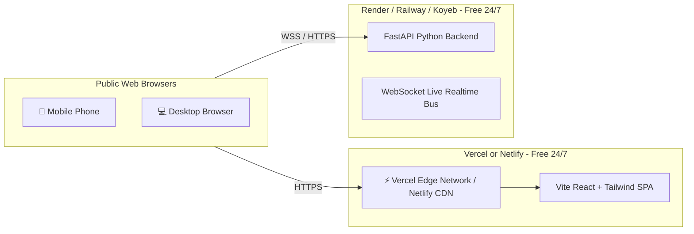

# 🚀 24/7 Free Cloud Deployment Guide for Ardhnarishwar AI SaaS

Deploy your full-stack AI SaaS platform live to the internet for **100% free**, accessible 24/7 by anyone on mobile, tablet, or desktop via a secure public HTTPS URL.

---

## 🏗️ Architecture Overview for Free Hosting



---

## ⚡ Method 1: Deploy Frontend on Vercel + Backend on Render (Recommended)

This is the fastest, zero-maintenance, 100% free stack.

### Step 1: Push Code to GitHub

Open your terminal in the project root and run:

```bash
# Initialize git if not already initialized
git init

# Stage all files including vercel.json, netlify.toml, render.yaml
git add .

# Commit changes
git commit -m "feat: Add production deployment configurations for Vercel, Netlify and Render"

# Link to your GitHub repository (replace with your repo URL)
git branch -M main
git remote add origin https://github.com/YOUR_GITHUB_USERNAME/Ardhnarishwar-AI-Interview-SaaS.git
git push -u origin main
```

---

### Step 2: Deploy Frontend on Vercel (100% Free)

1. Go to [https://vercel.com](https://vercel.com) and sign in with your GitHub account.
2. Click **"Add New..."** > **"Project"**.
3. Import your `Ardhnarishwar-AI-Interview-SaaS` repository.
4. In the Project Configuration:
   - **Framework Preset**: `Vite` (automatically detected from [`vercel.json`](file:///c:/Users/varsha/OneDrive/Desktop/Ardhnarishwar-AI-Interview-SaaS/vercel.json))
   - **Root Directory**: `./` (default)
   - **Build Command**: `npm run build`
   - **Output Directory**: `dist`
5. *(Optional)* Under **Environment Variables**, add:
   - `VITE_WS_URL`: `wss://your-backend-service.onrender.com` (from Step 3)
   - `VITE_API_URL`: `https://your-backend-service.onrender.com`
6. Click **"Deploy"**.
7. In ~30 seconds, your site will be live at `https://your-project.vercel.app`! 🎉

---

### Step 3: Deploy Backend on Render (100% Free)

1. Go to [https://render.com](https://render.com) and sign up with GitHub.
2. Click **"New +"** > **"Web Service"**.
3. Select your GitHub repository.
4. Fill in the configuration:
   - **Name**: `ardhnarishwar-backend-api`
   - **Region**: `Oregon (US West)` or nearest
   - **Root Directory**: `backend`
   - **Runtime**: `Python 3`
   - **Build Command**: `pip install -r requirements.txt`
   - **Start Command**: `uvicorn main:app --host 0.0.0.0 --port $PORT`
   - **Instance Type**: `Free` ($0/month)
5. Under **Environment Variables**, add:
   - `ENVIRONMENT`: `production`
   - `SECRET_KEY`: `generate_any_64_character_random_string`
   - `ALLOWED_ORIGINS`: `https://your-project.vercel.app,https://your-project.netlify.app`
6. Click **"Create Web Service"**.
7. Render will build and launch your backend with a public URL like `https://ardhnarishwar-backend-api.onrender.com`!

---

## 🌐 Method 2: Deploy on Netlify (Alternative Frontend)

1. Go to [https://app.netlify.com](https://app.netlify.com).
2. Click **"Add new site"** > **"Import an existing project"**.
3. Connect with GitHub and select your repository.
4. Netlify will automatically detect [`netlify.toml`](file:///c:/Users/varsha/OneDrive/Desktop/Ardhnarishwar-AI-Interview-SaaS/netlify.toml):
   - **Build command**: `npm run build`
   - **Publish directory**: `dist`
5. Click **"Deploy site"**.
6. Your live site will be ready at `https://random-name.netlify.app` (which you can rename under Site Settings).

---

## 📦 Method 3: 1-Click Render Blueprint (`render.yaml`)

We have included a complete [`render.yaml`](file:///c:/Users/varsha/OneDrive/Desktop/Ardhnarishwar-AI-Interview-SaaS/render.yaml) Blueprint in the root directory.

1. Go to [https://dashboard.render.com/blueprints](https://dashboard.render.com/blueprints).
2. Click **"New Blueprint Instance"**.
3. Connect your repository.
4. Render will read `render.yaml` and **automatically provision BOTH**:
   - `ardhnarishwar-frontend-app` (Free Static Site)
   - `ardhnarishwar-backend-api` (Free Python Web Service)
5. Click **"Apply"** and both will deploy together!

---

## 💻 Method 4: Deploy Directly via Terminal CLI

### Deploy to Vercel via CLI:
```bash
# Install Vercel CLI globally
npm install -g vercel

# Login to Vercel
vercel login

# Deploy production release
vercel --prod
```

### Deploy to Netlify via CLI:
```bash
# Install Netlify CLI globally
npm install -g netlify-cli

# Login to Netlify
netlify login

# Deploy production release
netlify deploy --prod --dir=dist
```

---

## 🛠️ Verification Checklist for Public Production

- [x] Responsive layout tested on Mobile, Tablet & Desktop viewports.
- [x] Zero external API dependencies (100% in-house modular scoring).
- [x] WebRTC Video Conference Camera & Microphone permissions configured in headers (`Permissions-Policy`).
- [x] Client-side SPA routing rewrites configured (`vercel.json`, `netlify.toml`).
- [x] Cross-tab real-time event bus enabled for multi-user simulation on any device.
- [x] SSL/HTTPS encryption automatically provisioned by Vercel/Netlify.
