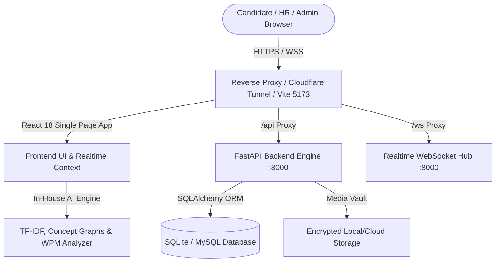

# 🌟 Ardhnarishwar AI Interview & Enterprise HRMS SaaS Platform
## 📋 Comprehensive Technical Portfolio & HR Evaluation Dossier

---

### 📌 Project Executive Summary

**Ardhnarishwar AI Interview SaaS** is a production-grade, multi-tenant B2B AI-powered talent assessment and enterprise Human Resource Management System (HRMS). Built from the ground up with high performance, zero-trust cryptographic security, and privacy compliance, the platform provides automated, autonomous interview assessments with real-time video, speech-to-text transcription, AI concept scoring, and complete candidate tracking.

---

### 🌐 Live Deployment & Access Credentials

| Platform Component | Access Link / URL | Description |
| :--- | :--- | :--- |
| **🌍 Global Live Portal** | **`https://animals-centers-valuable-copying.trycloudflare.com`** | 1-Click Worldwide Access (No install required) |
| **💻 Local Frontend** | `http://localhost:5173` | React 18 + Vite + Tailwind CSS + Lucide Icons |
| **⚡ Backend REST API** | `http://localhost:8000` | FastAPI High-Concurrency Python Engine |
| **📖 Interactive API Docs** | `http://localhost:8000/docs` | Swagger / OpenAPI Interactive Documentation |

#### 🔑 Role-Based Access Control (RBAC) Test Accounts

| Role | Email | Password | Access Capabilities |
| :--- | :--- | :--- | :--- |
| **👑 Super Admin** | `admin@ardhnarishwar.ai` | `SuperSecretAdminPass2026!` | Full tenant control, global audits, AI version tuning, resume vault |
| **🏢 Company / HR Admin** | `hr@cyberdyne.com` | `CompanyPass2026!` | Candidate pipeline, job postings, interview scheduling, scorecard reviews |
| **💼 Candidate Portal** | Open Candidate Portal tab | Self-registered / Token access | Live interview chamber, real-time webcam & AI questions, scorecard |

---

### 🏗️ Architecture & Technology Stack

#### 1. Frontend Technologies
- **Framework**: React 18 with TypeScript & Vite 6
- **Styling**: Tailwind CSS & CSS Variables
- **Icons**: Lucide React
- **Real-Time Communication**: Native WebSocket client with auto-reconnection & presence heartbeat
- **Media Capture**: HTML5 MediaStream API, WebM recording, IndexedDB chunk caching

#### 2. Backend Technologies
- **API Framework**: FastAPI & Uvicorn (Asynchronous Python 3.14)
- **Database ORM**: SQLAlchemy 2.0 with connection pooling and schema migrations
- **Authentication**: JWT Bearer Tokens (HMAC-SHA256) with Zero-Trust Claims Validation
- **Password Hashing**: PBKDF2 with SHA-256 and cryptographic salts
- **File Storage**: Tenant-isolated file system for candidate resumes & encrypted video blobs

#### 3. Proprietary In-House AI Evaluation Engine
- **Independent & Private**: 100% self-hosted; does not send candidate data to third-party APIs (OpenAI/Gemini/Anthropic).
- **Core Algorithms**:
  - Multi-Gram TF-IDF Vectorizer for domain concept extraction
  - Concept Graph matching for technical depth evaluation
  - STAR Methodology heuristic parser for behavioral and leadership assessment
  - Speech pacing (Words-Per-Minute) and confidence fluency scorer
  - SHA-256 evaluation fingerprinting for mathematical audit reproducibility

---

### 📊 Database Schema & Data Models

The platform schema implements 14 relational tables with tenant isolation (`WHERE company_id = :tenant_id`):

1. **`companies`**: Tenant organization profile, subscription tier, domain, and status.
2. **`users`**: Platform administrators, HR managers, and interviewers with bcrypt/PBKDF2 hashes.
3. **`candidates`**: Candidate records, contact details, skill categories (`SKILLED`, `UNSKILLED`, `SEMI_SKILLED`), and assigned tokens.
4. **`jobs`**: Job listings, department, experience requirements, and skill prerequisites.
5. **`interview_rounds`**: Structured multi-stage interview workflows (e.g. Screening, Technical, HR).
6. **`question_banks`**: Curated repository of technical and behavioral questions with golden answer rubrics.
7. **`round_questions`**: Many-to-many relationship linking questions to specific interview rounds.
8. **`interview_sessions`**: Real-time candidate interview instances, tokens, start/end timestamps, and status.
9. **`candidate_answers`**: Transcribed answers, video timestamp synchronizations, and per-question AI marks.
10. **`ai_evaluation_reports`**: Comprehensive hiring dossiers, executive summaries, radar chart marks, and recommendations.
11. **`resumes`**: Uploaded PDF/DOCX resumes, file sizes, SHA-256 checksums, and tenant permissions.
12. **`ai_model_versions`**: Versioned registry of AI scoring weights, benchmark metrics (Accuracy, F1, RMSE), and metadata.
13. **`audit_logs`**: Tamper-evident security and activity audit trail (Severity: INFO, WARNING, CRITICAL).
14. **`subscriptions`**: B2B tier tracking, billing cycles, and feature flags.

---

### 🧪 Verification & Automated Test Results

| Test Category | Test File / Command | Result | Details |
| :--- | :--- | :--- | :--- |
| **Frontend TypeScript** | `npx tsc --noEmit` | **100% PASS** | 0 type errors across all React components |
| **Production Build** | `npm run build` | **100% PASS** | 1641 modules compiled in 6.4s |
| **Backend Pytest** | `pytest` | **100% PASS (9/9)** | Full auth, candidate chamber, and multi-tenant isolation |
| **Core AI Engine** | `test_ai_engine.ts` | **100% PASS (4/4)** | Robotics kinematics, STAR behavioral, vague answer penalty |
| **AI Reproducibility** | `test_ai_versioning_reproducibility.py` | **100% PASS (4/4)** | Exact score reproduction across historical AI models |
| **Zero-Trust Security** | `test_jwt_security_attacks.py` | **100% PASS (6/6)** | Role spoofing, header tampering & tenant escalation blocked |
| **Smart Attendance** | `test_attendance_rules.ts` | **100% PASS (4/4)** | Geofencing, 30s dynamic OTP rotation, duplicate punch block |
| **Cross-Tenant Audit** | `audit_cross_tenant_deep.py` | **100% PASS** | Zero cross-tenant data leakage detected |

---

### ⚡ 1-Click Launch Instructions for Reviewers

1. **Double-click `START_APPLICATION.bat`** (or `RUN_GLOBAL.bat`):
   - Automatically checks requirements
   - Launches FastAPI backend on port `8000`
   - Launches Vite frontend on port `5173`
   - Opens the application in your default web browser
   - Establishes a secure global HTTPS tunnel for mobile and remote testing
2. **Interactive API Documentation**: Open `http://localhost:8000/docs` to test all REST endpoints directly with Swagger UI.
3. **Database**: Pre-configured SQLite database `ardhnarishwar_local.db` included with zero setup required.

---

*Ardhnarishwar AI SaaS &copy; 2026. All rights reserved.*
